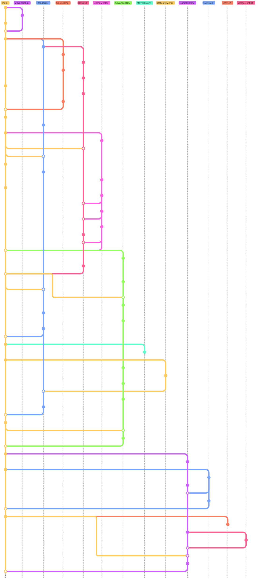

# Backlog
## Advanced Topics
### Advanced Topic One - Maven Build System
Our first advanced topic Maven was chosen when we were planning our project and realised it would require external
dependencies. To manage these dependencies we decided to use Maven, a cross platform dependency manager that uses
a config file [pom.xml](../pom.xml) to declare the dependencies. For our project we installed the following extra
packages:

#### JavaFX
JavaFX is a cross-platform rendering framework that supports 2D and 3D, as for the UI we were required to use swing
javafx is only handling purely 3D content and implement via a jfxpanel. Which is a swing implementation where the jfx 
scene inherits from a jpanel and can be used as a jpanel. A downside to jfxpanel we didn't realise is that the rendering
system is os-specific, this caused issues on Windows which uses directx and we had to implement a less satisfactory
work around. If we were to do this again we would use gljpanel a similar swing implementation of 3D or 2D rendering but
via opengl, which is supported and renders the same on all operating systems.

#### JUnit Jupiter & Maven Surefire
JUnit Jupiter is a JUnit test api which we used for designing the tests in our project; Maven surefire is what integrates
the tests into the mvn build system. The current tests we have
implemented are:
- [Check All Winning Lines](../src/test/java/dev/ccsio/qubic/CheckAllWinningLinesTest.java) - For efficiency we 
hardcoded all the winning lines into a class so they don't need to be generated every time the project runs, and since
they never change. However we needed a test to make sure that they were correct so whenever you build the project using maven a test
runs to verify they are all correct.
- [Check OA Blocking](../src/test/java/dev/ccsio/qubic/CheckOABlockWinTest.java) - Our OA's (Opponent Algorithms) are
designed so no matter the difficulty they will always block your immediate win, we test this by doing a random horizontal
and vertical coordinate for each difficulty and checking we didn't win/
- [Check Win Detection](../src/test/java/dev/ccsio/qubic/CheckWinDetectionTest.java) - We have the check all winning
lines test run first but we need to check the backend of the game actually detects we have won as well, this is done
- by going into two-player mode to make sure the OA's don't block us and testing every winning line, skips diagonals. 

#### Flatlaf
Flatlaf is simply a UI theme pack that provides some better looking presets for swing and is being used for our buttons.

#### Json
The json dependency is being used to save our past games, they are all saved in relevant appdata locations depending
on your operating system, they are then used in game so you can preview the past match.

#### Maven Shade
We have the maven shade plugin installed so we can create a jar file known as a uber jar, it contains all the
internal dependencies required for any operating system so someone with java 17+ can run this file by itself.

### Advanced Topic Two - Git & Github
We needed a way to collaborate on the project together but not necessarily at the same time, using the git system
and hosting on github was the solution to this. We used the only working commits in main principle where every stage of
main should work and all other in-development features were done on their own respective branches. We used many git
commands in this project including:
- git stash
- git rebase
- git merge
- git push
- git pull
- git checkout
- git cherry-pick
- git branch

We handled any merge conflicts that arose, and used github pull request feature when merging into main. Below here is
a squashed representation of our project's git graph.

## High Priority Features
### Play Screen (Completed)
- Demo: When running the file, an intro screen appears with a 1-Player and 2-Player buttons.
- Notes: Add an intro/welcome screen with 2 Play-button.

### Input (Completed)
- Demo: Using the mouse both players can click on a square marking it as theirs. Invalid (positions) clicks are voided.
- Notes: Display four 4x4 2D boards indicating which corresponds to which layer (z=0,1,2,3) in the 3D view. 

### Turn System (Completed)
- Demo: When playing the game 2 of the same mark cannot be placed consecutively.
- Notes: Switch marks between each input. 

### Row Checking - Win Detection (Completed)
- Demo: If a player has a "row", the win screen will appear congratulating them on their win.
- Notes: Check after every input all rows that could have been completed by this move

## Medium Priority Features
### Win Screen (Completed)
- Demo: A Win screen appears after a player won
- Notes: Create a screen that congratulates the winning player on their success

### 3D View (Completed)
- Demo: A dynamic 3D Render of the Qubic appears below the input boards and is updated in real-time.
- Notes: Implement a 3D render library to display a 3D-array 4x4x4 array.

### 3D View - Camera Controls (Completed)
- Demo: In the 3D view, the user can pan and rotate the camera to inspect different angles.
- Notes: Add mouse controls for rotating, zoom, and panning.

### Visual Feedback - Selection & Invalid Moves (Completed)
- Demo: Hovering over an input square highlights it on the input board and 3D render. Shows different color when the selection is invalid. 
- Improves UX and usability. 

### Artificial Player (Completed)
- Demo: When user selects the 1-Player mode, all inputs for Player-2 are done automatically by the computer. 
- Notes: Implement a simple program to make semi-calculated moves in response to Player-1 (the human).

## Low Priority Features
### Restart Function (Completed)
- Demo: A restart button appears on the Win screen that when presses resets the game allowing players to rematch. 
- Notes: Add a restart button on the Win screen to allow the players to rematch

### Win-Line Highlight (Incomplete)
- Demo: The winning line is highlighted upon winning.
- Notes: Matching color for the player. 

## Very-Low Priority Features
### Move History (Completed)
- Demo: a move-history timeline is shown at the bottom of the window. 
- Notes: Show moves done by both players.